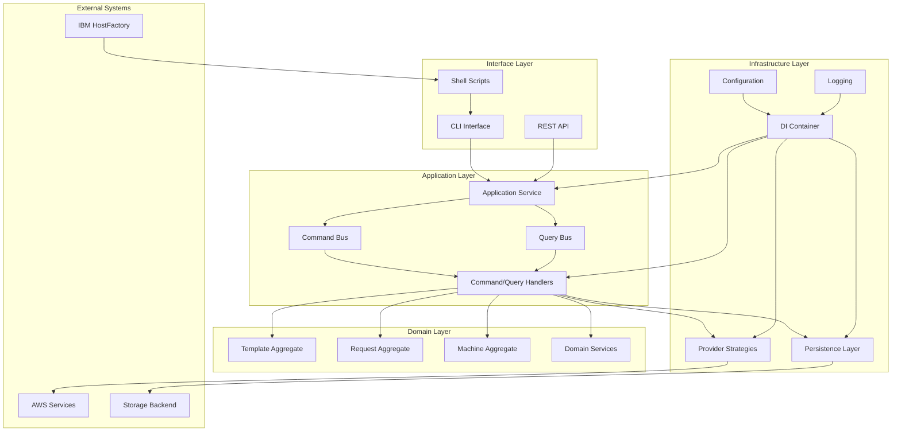
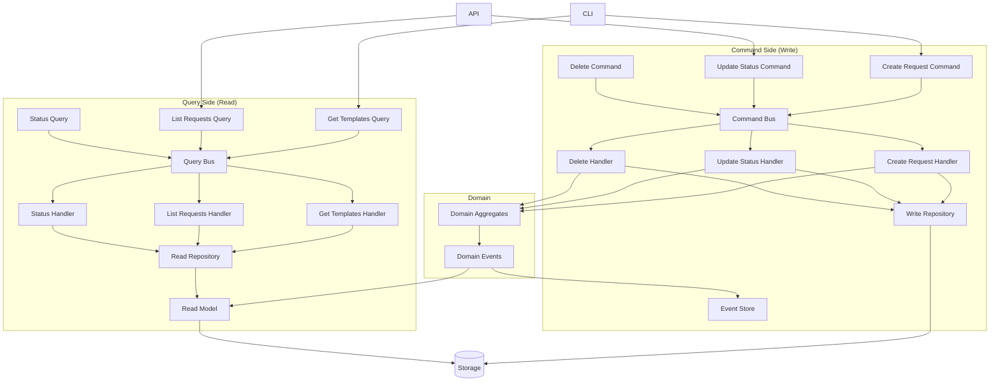
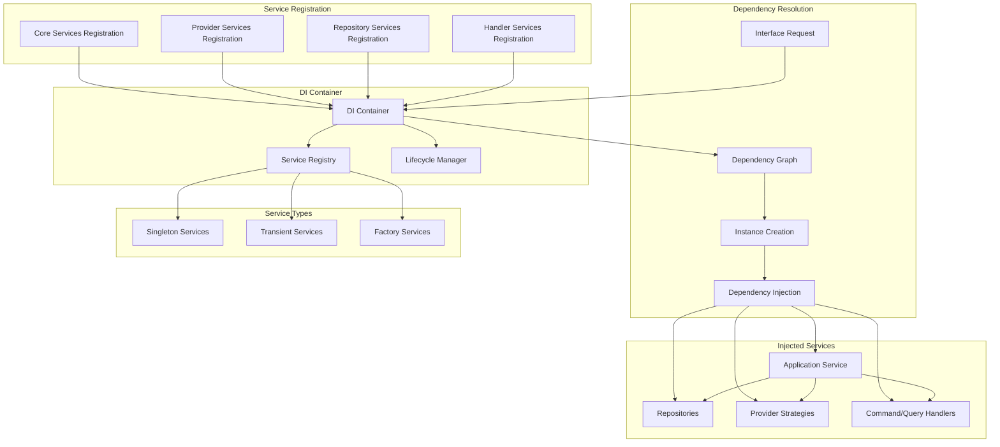
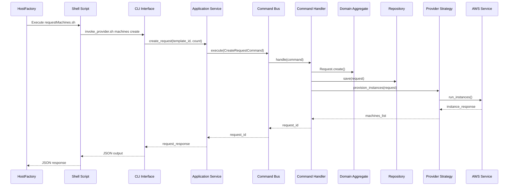
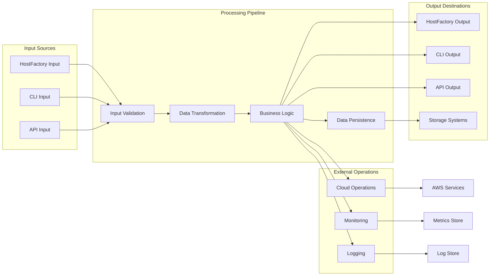
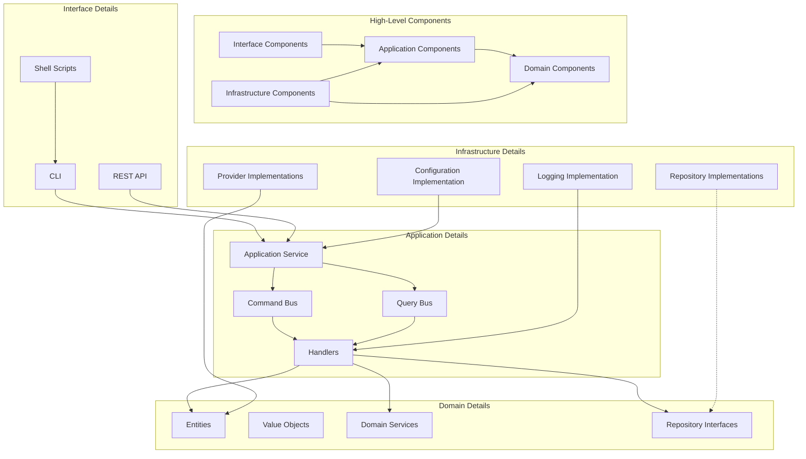

# System Architecture Diagrams

This document provides visual representations of the Open Host Factory Plugin's architecture using diagrams to illustrate system components, data flow, and interactions.

## Overall System Architecture



## Clean Architecture Layers

```mermaid
graph LR
    subgraph "External"
        User[User/HostFactory]
        Cloud[Cloud Provider]
        DB[Database]
    end
    
    subgraph "Interface Layer (Outermost)"
        CLI[CLI Interface]
        REST[REST API]
        Scripts[Shell Scripts]
    end
    
    subgraph "Infrastructure Layer"
        Repos[Repository Implementations]
        CloudAdapters[Cloud Adapters]
        ConfigMgr[Configuration Manager]
        Logger[Logging Implementation]
    end
    
    subgraph "Application Layer"
        UseCases[Use Cases]
        AppServices[Application Services]
        DTOs[DTOs]
        CommandHandlers[Command Handlers]
        QueryHandlers[Query Handlers]
    end
    
    subgraph "Domain Layer (Innermost)"
        Entities[Domain Entities]
        ValueObjects[Value Objects]
        DomainServices[Domain Services]
        RepoInterfaces[Repository Interfaces]
        Ports[Ports/Interfaces]
    end
    
    User --> CLI
    User --> REST
    User --> Scripts
    
    CLI --> UseCases
    REST --> UseCases
    Scripts --> CLI
    
    UseCases --> AppServices
    AppServices --> CommandHandlers
    AppServices --> QueryHandlers
    
    CommandHandlers --> Entities
    QueryHandlers --> Entities
    CommandHandlers --> DomainServices
    QueryHandlers --> DomainServices
    
    CommandHandlers --> RepoInterfaces
    QueryHandlers --> RepoInterfaces
    
    Repos -.-> RepoInterfaces
    CloudAdapters -.-> Ports
    ConfigMgr -.-> Ports
    Logger -.-> Ports
    
    Repos --> DB
    CloudAdapters --> Cloud
    
    style "Domain Layer (Innermost)" fill:#e1f5fe
    style "Application Layer" fill:#f3e5f5
    style "Infrastructure Layer" fill:#fff3e0
    style "Interface Layer (Outermost)" fill:#e8f5e8
```

## CQRS Pattern Flow



## Provider Strategy Pattern

```mermaid
graph TB
    subgraph "Strategy Context"
        ProviderContext[Provider Context]
        StrategyFactory[Provider Strategy Factory]
    end
    
    subgraph "Strategy Interface"
        ProviderStrategy[Provider Strategy Interface]
    end
    
    subgraph "Concrete Strategies"
        AWSStrategy[AWS Provider Strategy]
        MockStrategy[Mock Provider Strategy]
        FutureStrategy[Future Provider Strategy]
    end
    
    subgraph "AWS Implementation"
        AWSClient[AWS Client]
        EC2Handler[EC2 Fleet Handler]
        SpotHandler[Spot Fleet Handler]
        ASGHandler[ASG Handler]
        RunInstancesHandler[Run Instances Handler]
    end
    
    subgraph "Handler Factory"
        HandlerFactory[AWS Handler Factory]
        HandlerRegistry[Handler Registry]
    end
    
    ProviderContext --> StrategyFactory
    StrategyFactory --> ProviderStrategy
    
    ProviderStrategy <|-- AWSStrategy
    ProviderStrategy <|-- MockStrategy
    ProviderStrategy <|-- FutureStrategy
    
    AWSStrategy --> AWSClient
    AWSStrategy --> HandlerFactory
    
    HandlerFactory --> HandlerRegistry
    HandlerRegistry --> EC2Handler
    HandlerRegistry --> SpotHandler
    HandlerRegistry --> ASGHandler
    HandlerRegistry --> RunInstancesHandler
    
    EC2Handler --> AWSClient
    SpotHandler --> AWSClient
    ASGHandler --> AWSClient
    RunInstancesHandler --> AWSClient
    
    AWSClient --> AWS[AWS Services]
```

## Dependency Injection Flow



## Request Processing Flow



## Data Flow Architecture



## Component Interaction Matrix



These diagrams provide visual representations of the system architecture, making it easier to understand the relationships between components, data flow, and architectural patterns implemented in the Open Host Factory Plugin.
